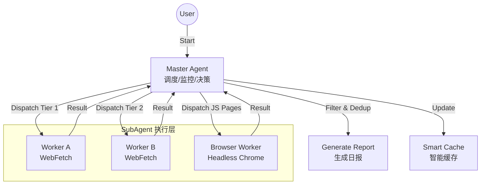

# Erduo Skills / 耳朵技能库

[English](README_EN.md)

> 为 AI Agent 赋能，提供结构化能力与智能工作流。

## 📖 简介

**Erduo Skills** 是一个专门用于管理 AI Agent 智能技能的仓库。它作为一个知识库和执行框架，使 Agent 能够执行自动新闻报道、数据分析等复杂任务。

---

## ✨ 技能：AK RSS Digest

**AK RSS Digest** 是一个面向 AI Agent 阅读场景的精选 RSS 摘要技能。它会从固定的 RSS/Atom 源列表中抓取最近一周的文章，优先筛选 AI agent、前沿 AI 判断、深度访谈和不太枯燥的高信息密度内容。

### 🚀 核心特性

- **固定信源聚合**:
  - 使用预设 RSS/Atom 源清单，避免每次重新找源。
  - 默认抓取最近 7 天，也支持显式指定某一天。

- **智能打分与筛选**:
  - 对候选文章按 10 分制打分。
  - 只输出高于 7 分的内容，过滤纯论文、发布说明和过于枯燥的技术条目。

- **中文日报口吻输出**:
  - 输出统一采用中文字段：标题、评分、推荐语、摘要、链接。
  - 风格偏简洁日报，不写成冗长报告。

### 💻 使用方法

该技能适合通过 Agent 直接调用，也可以使用内置脚本先抓取候选文章：

```bash
python skills/ak-rss-digest/scripts/fetch_today_feed_items.py --format json
```

- 默认抓取最近一周的文章
- 如需只看某一天，可加 `--date YYYY-MM-DD --days 1`

*提示词示例:*
> “用 `$ak-rss-digest` 拉取最近一周的 RSS，筛出 7 分以上的文章，按中文日报格式输出。”

### 📄 目录说明

- `skills/ak-rss-digest/SKILL.md`: 技能主说明与筛选规则
- `skills/ak-rss-digest/scripts/fetch_today_feed_items.py`: RSS 抓取脚本
- `skills/ak-rss-digest/references/feeds.opml`: 固定 RSS 源列表

---

## ✨ 技能：Gemini 水印移除

**Gemini Watermark Remover** 是一个利用逆向 Alpha 混合技术去除 Gemini 生成图片水印的工具。适用于需要批量处理 Gemini 图片或集成去水印功能的场景。

### 🚀 核心特性

- **精准去水印**:
  - 针对 Gemini 图片右下角水印进行像素级还原。
  - 使用预制 Alpha 遮罩（48px/96px）确保高质量去除。
  
- **纯 Python 实现**:
  - 核心算法仅依赖 Pillow，轻量且易于修改。
  - 提供 CLI 命令行工具，方便集成到工作流中。

### 💻 使用方法

该技能需要两个参数：输入图片路径和输出图片路径。

```bash
python skills/gemini-watermark-remover/scripts/remove_watermark.py <input-image> <output-image>
```

- `input-image`: 包含 Gemini 水印的原始图片路径
- `output-image`: 去除水印后的图片保存路径

### 📄 效果

- 如果你需要调整检测规则，可以参考 `skills/gemini-watermark-remover/references/algorithm.md`。

---

## ✨ 精选技能：每日日报

**每日日报** 是一个高级技能，旨在自动从多个来源抓取、筛选并总结高质量的技术新闻。

### 🏗 核心架构

该技能采用 **Master-Worker** 架构，包含智能调度器和专用子 Agent。



### 🚀 核心特性

- **多源抓取**:
  - 聚合 HackerNews, HuggingFace Papers 等优质源。
  
- **智能筛选**:
  - 筛选高质量技术内容，排除营销软文。
  
- **动态调度**:
  - 采用“早停机制”：一旦抓取到足够的高质量条目（如 20 条），即停止抓取以节省资源。

- **无头浏览器支持**:
  - 使用 MCP Chrome DevTools 处理复杂的 JS 渲染页面（如 ProductHunt）。

### 📄 输出示例

日报以结构化 Markdown 格式生成，存储在 `NewsReport/` 目录下。

> **Daily News Report (2024-03-21)**
>
> **1. 文章标题**
> - **摘要**: 文章内容的简要总结...
> - **要点**: 
>   1. 要点一
>   2. 要点二
> - **来源**: [链接](...) 
> - **评分**: ⭐⭐⭐⭐⭐

---

## 📂 项目结构

```bash
├── .claude/
│   └── agents/       # Agent 定义 (Personas & Prompts)
├── skills/           # 技能实现 (例如 daily-news-report)
│   └── daily-news-report/  # 每日日报技能
│   └── ak-rss-digest/      # RSS 精选摘要技能
├── NewsReport/       # 生成的日报存档
├── README.md         # 项目文档 (默认为中文)
└── README_EN.md      # 英文项目文档
```

## 🛠 使用方法

1.  **克隆仓库**
    ```bash
    git clone https://github.com/Start-to-DJ/erduo-skills.git
    cd erduo-skills
    ```

2.  **使用 Agent 运行**
    将此仓库加载到您的 Agent 环境中（例如 Claude Desktop 或支持 MCP 的 Zed）。Agent 将自动识别 `daily-news-report`、`ak-rss-digest` 等技能。

    *提示词示例:*
    > “生成今天的日报。”
    
    > “用 `$ak-rss-digest` 生成最近一周值得看的 RSS 摘要。”

## 🤝 贡献指南

欢迎贡献！如果您有新的技能想法，请参考 `.claude/skills` 目录下的示例。

---

*Created with ❤️ by Erduo*
