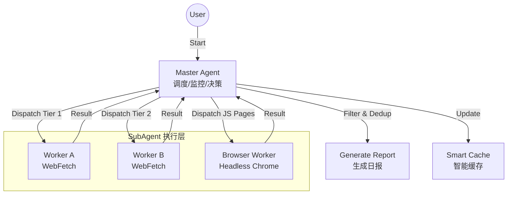

# Erduo Skills / 耳朵技能库

[English](README_EN.md)

> 为 AI Agent 赋能，提供结构化能力与智能工作流。

**Erduo Skills** 是一个 AI Agent 技能库，收录了一系列可被 Agent 直接调用的结构化技能。每个技能都是独立的、可组合的工作流单元，覆盖信息获取、内容处理、图像工具等场景。

## 安装

### 快捷安装（推荐）

```bash
npx skills add rookie-ricardo/erduo-skills
```

## 技能一览

| 技能 | 简介 | 调用方式 |
|------|------|----------|
| [每日日报](#-每日日报) | 多源抓取 + 智能筛选，自动生成技术日报 | Agent 调用 |
| [AK RSS Digest](#-ak-rss-digest) | 固定 RSS 源精选摘要，10 分制打分过滤 | Agent 调用 / CLI |
| [转录精修师](#-转录精修师) | 语音转录文本 → 可读文章，保留原汁原味 | Agent 调用 |
| [翻译精修师](#-翻译精修师) | 四步精翻工作流，支持中英 / 中日双向精翻 | Agent 调用 |
| [Gemini 水印移除](#-gemini-水印移除) | 逆向 Alpha 混合去除 Gemini 图片水印 | CLI |

---

## 🗞 每日日报

```bash
npx skills add rookie-ricardo/erduo-skills --skill daily-news-report
```

自动从多个优质信源抓取、筛选并总结技术新闻，生成结构化日报。

采用 Master-Worker 架构：主 Agent 负责调度与决策，子 Agent 并行抓取，支持无头浏览器处理 JS 渲染页面。



- 聚合 HackerNews、HuggingFace Papers、ProductHunt 等多层级信源
- 10 分制打分 + 内容去重（URL + 内容哈希双重校验）
- 早停机制：收集到 20+ 高质量条目即停止，节省资源
- 输出 Markdown 日报至 `NewsReport/` 目录

*提示词示例：*
> "生成今天的日报。"

---

## 📰 AK RSS Digest

```bash
npx skills add rookie-ricardo/erduo-skills --skill ak-rss-digest
```

从固定 RSS/Atom 源中精选高质量文章，聚焦 AI agent、前沿 AI 判断、深度访谈等高信息密度内容。

- 预设信源清单，默认抓取最近 7 天
- 10 分制打分，仅输出 7 分以上内容
- 过滤纯论文摘要、厂商营销、SEO 水文
- 中文日报口吻输出：标题、评分、推荐语、摘要、链接

```bash
# 也可直接运行抓取脚本
python skills/ak-rss-digest/scripts/fetch_today_feed_items.py --format json

# 指定某一天
python skills/ak-rss-digest/scripts/fetch_today_feed_items.py --date 2026-03-18 --days 1
```

*提示词示例：*
> "用 `$ak-rss-digest` 拉取最近一周的 RSS，筛出 7 分以上的文章，按中文日报格式输出。"

---

## ✍️ 转录精修师

```bash
npx skills add rookie-ricardo/erduo-skills --skill transcript-polisher
```

将语音转录文本（访谈、演讲、播客、会议）精修为高可读性文章。核心原则：文字精修师，不是内容概括师——保留原句原词，拒绝高度概括。

- 自动识别"单人表达"或"多人对谈"模式
- 精准降噪：删除口水词（然后、那个、呃）、无意义附和（对对对、没错）
- 同音字纠错 + 专有名词修正
- 语义呼吸分段：按意群重组段落，而非机械按长度切割
- 长文本自动分 chunk（~5000 字），子 Agent 并行处理后合并

输入格式：

```
视频标题：xxx
视频作者：xxx
视频时长：xxx

--- 字幕内容 ---
<字幕文本>
```

输出格式：

```
## 视频信息
标题 / 作者 / 时长

## 导读
核心思想总结

## 正文
精修后的全文
```

---

## 🌐 翻译精修师

```bash
npx skills add rookie-ricardo/erduo-skills --skill translate-polisher
```

用于高质量文章翻译与本地化，采用 **分析 → 初译 → 审校 → 终稿** 四步工作流。仅支持 `ZH↔EN`、`ZH↔JA` 双向翻译，不支持 `EN↔JA` 直译。

- 支持文件路径、URL 或直接粘贴正文作为输入
- 支持 `--from`、`--to`、`--audience`、`--style`、`--glossary` 参数
- 翻译前先做术语提取、修辞映射、读者理解障碍分析
- 内置 `EN↔ZH`、`ZH↔JA` 术语表，可与自定义术语表合并
- 长文本会自动分块，由子 Agent 并行翻译后再合并审校
- 内置 9 种风格预设，默认 `auto`，也支持自定义风格描述

```
/translate [--from <lang>] [--to <lang>] [--audience <audience>] [--style <style>] [--glossary <file>] <source>
```

*提示词示例：*
> "翻译这篇文章 https://example.com/article"
> "把这篇中文文章翻成英文，面向技术读者 --style technical"

---

## 🖼 Gemini 水印移除

```bash
npx skills add rookie-ricardo/erduo-skills --skill gemini-watermark-remover
```

利用逆向 Alpha 混合算法去除 Gemini 生成图片右下角的水印，像素级还原。

- 纯 Python 实现，仅依赖 Pillow
- 预制 Alpha 遮罩：48px（小图）/ 96px（>1024x1024 大图）
- 算法原理：`original = (watermarked - alpha × logo) / (1 - alpha)`

```bash
python skills/gemini-watermark-remover/scripts/remove_watermark.py <输入图片> <输出图片>
```

算法细节参见 `skills/gemini-watermark-remover/references/algorithm.md`

---

## 📂 项目结构

```
erduo-skills/
├── .claude/
│   └── agents/                     # Agent 定义
├── skills/
│   ├── daily-news-report/          # 每日日报
│   │   ├── SKILL.md
│   │   ├── sources.json
│   │   └── cache.json
│   ├── ak-rss-digest/             # RSS 精选摘要
│   │   ├── SKILL.md
│   │   ├── scripts/
│   │   └── references/feeds.opml
│   ├── transcript-polisher/        # 转录精修师
│   │   ├── SKILL.md
│   │   └── references/
│   ├── translate-polisher/         # 翻译精修师
│   │   ├── SKILL.md
│   │   └── references/
│   └── gemini-watermark-remover/   # Gemini 水印移除
│       ├── SKILL.md
│       ├── scripts/
│       ├── assets/
│       └── references/
├── NewsReport/                     # 生成的日报存档
├── README.md
└── README_EN.md
```

## Claude Code 安装补充

本仓库支持作为 Claude Code plugin marketplace 注册。

### Claude Code 原生命令

先添加 marketplace：

```bash
/plugin marketplace add rookie-ricardo/erduo-skills
```

再按功能安装 plugin bundle：

```bash
/plugin install research-workflows@erduo-skills
/plugin install writing-workflows@erduo-skills
/plugin install image-tools@erduo-skills
```

各 bundle 包含的 skills：

- `research-workflows`：`ak-rss-digest`、`daily-news-report`
- `writing-workflows`：`transcript-polisher`、`translate-polisher`
- `image-tools`：`gemini-watermark-remover`

本地测试可直接使用仓库路径：

```bash
/plugin marketplace add ./
/plugin install research-workflows@erduo-skills
```

如果你使用 `skills` CLI，也可以直接添加当前仓库：

```bash
npx skills add rookie-ricardo/erduo-skills
```

## 🤝 贡献

欢迎贡献新技能！每个技能是 `skills/` 下的独立目录，包含 `SKILL.md`（技能定义）和相关脚本/资源。

---

*Created with ❤️ by Erduo*
