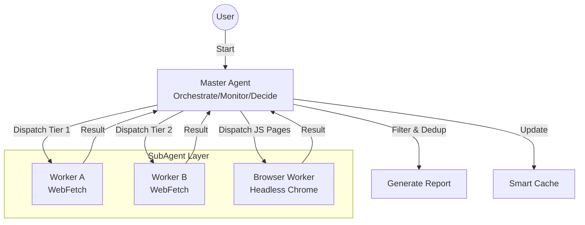

# Erduo Skills

[中文](README.md)

> Empowering AI Agents with structured capabilities and intelligent workflows.

## 📖 Overview

**Erduo Skills** is a specialized repository designed to house and manage intelligent skills for AI agents. It serves as a knowledge base and execution framework, enabling agents to perform complex tasks such as autonomous news reporting, data analysis, and more.

---

## ✨ Skill: AK RSS Digest

**AK RSS Digest** is a curated RSS reading skill for AI-agent-heavy workflows. It pulls from a fixed RSS/Atom bundle, defaults to the latest 7 days, and prioritizes articles about AI agents, frontier AI thinking, deep interviews, and other high-signal non-boring reads.

### 🚀 Key Features

- **Fixed Feed Bundle**:
  - Uses a predefined RSS/Atom source list instead of rediscovering feeds each run.
  - Defaults to the latest week, with an option to narrow to a single day.

- **Scoring and Filtering**:
  - Scores candidate articles on a 10-point scale.
  - Only outputs items above 7, filtering out dry papers, release notes, and overly narrow technical logs.

- **Chinese Daily-Brief Output**:
  - Final output uses Chinese labels for title, score, recommendation, summary, and link.
  - Tone is intentionally brief and digest-like rather than formal.

### 💻 Usage

The skill is designed for agent invocation, but you can also run the bundled fetcher directly:

```bash
python skills/ak-rss-digest/scripts/fetch_today_feed_items.py --format json
```

- By default it fetches the latest week's posts
- To fetch a single day, add `--date YYYY-MM-DD --days 1`

*Prompt Example:*
> "Use `$ak-rss-digest` to pull the latest week's RSS posts, keep only items above 7/10, and format the result as a concise Chinese daily brief."

### 📄 Directory Notes

- `skills/ak-rss-digest/SKILL.md`: skill instructions and scoring rules
- `skills/ak-rss-digest/scripts/fetch_today_feed_items.py`: RSS fetcher
- `skills/ak-rss-digest/references/feeds.opml`: fixed feed bundle

---

## ✨ Skill: Gemini Watermark Remover

**Gemini Watermark Remover** is a utility that removes the visible Gemini AI watermark from images using reverse alpha blending. Ideal for batch processing or integrating watermark removal into pipelines.

### 🚀 Key Features

- **Precise Removal**:
  - Pixel-perfect restoration for the bottom-right Gemini watermark.
  - Uses pre-captured Alpha masks (48px/96px) for high-quality results.
  
- **Pure Python**:
  - Core algorithm only depends on Pillow; lightweight and easy to modify.
  - Includes a CLI tool for easy integration.

### 💻 Usage

This skill requires two parameters: existing image path and output image path.

```bash
python skills/gemini-watermark-remover/scripts/remove_watermark.py <input-image> <output-image>
```

- `input-image`: Path to the Gemini watermarked image
- `output-image`: Path to save the cleaned image

### 📄 Documentation

- For algorithm details and detection rules, see `skills/gemini-watermark-remover/references/algorithm.md`.

---

## ✨ Featured Skill: Daily News Report

The **Daily News Report** is a sophisticated skill designed to autonomously fetch, filter, and summarize high-quality technical news from multiple sources.

### 🏗 Architecture

This skill utilizes a **Master-Worker** architecture with a smart orchestrator and specialized sub-agents.



### 🚀 Key Features

- **Multi-Source Fetching**:
  - Aggregates content from HackerNews, HuggingFace Papers, etc.
  
- **Smart Filtering**:
  - Filters for high-quality technical content, excluding marketing fluff.
  
- **Dynamic Scheduling**:
  - Uses an "Early Stopping" mechanism: if enough high-quality items are found (e.g., 20 items), it stops fetching to save resources.

- **Headless Browser Support**:
  - Handles complex, JS-rendered pages (e.g., ProductHunt) using MCP Chrome DevTools.

### 📄 Output Example

Reports are generated in structured Markdown format, stored in the `NewsReport/` directory.

> **Daily News Report (2024-03-21)**
>
> **1. Title of the Article**
> - **Summary**: A concise summary of the article...
> - **Key Points**: 
>   1. Point one
>   2. Point two
> - **Source**: [Link](...) 
> - **Rating**: ⭐⭐⭐⭐⭐

---

## 📂 Project Structure

```bash
├── .claude/
│   └── agents/       # Agent personas & prompts
├── skills/           # Executable skill definitions
│   └── daily-news-report/  # The Daily News Report skill
│   └── ak-rss-digest/      # Curated RSS digest skill
├── NewsReport/       # Generated daily reports
├── README.md         # Project documentation (Chinese by default)
└── README_EN.md      # Project documentation (English)
```

## 🛠 Usage

1.  **Clone the repository**
    ```bash
    git clone https://github.com/Start-to-DJ/erduo-skills.git
    cd erduo-skills
    ```

2.  **Run with Agent**
    Load this repository into your Agent environment (e.g., Claude Desktop, Zed with MCP). The Agent will automatically recognize skills such as `daily-news-report` and `ak-rss-digest`.

    *Prompt Example:*
    > "Generate today's news report."
    
    > "Use `$ak-rss-digest` to generate a curated RSS digest for the latest week."

## 🤝 Contributing

Contributions are welcome! If you have a new skill idea, please check the `.claude/skills` directory for examples.

---

*Created with ❤️ by Erduo*
