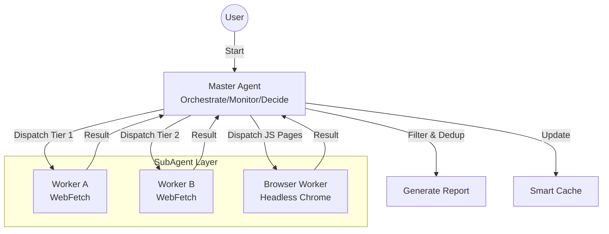

# Erduo Skills

[中文](README.md)

> Empowering AI Agents with structured capabilities and intelligent workflows.

**Erduo Skills** is an AI Agent skill library — a collection of structured, composable workflow units that agents can invoke directly. Skills cover information retrieval, content processing, image tooling, and more.

## Installation

### Quick Install (Recommended)

```bash
npx skills add rookie-ricardo/erduo-skills
```

## Skills at a Glance

| Skill | Description | Invocation |
|-------|-------------|------------|
| [Daily News Report](#-daily-news-report) | Multi-source scraping + smart filtering → tech daily report | Agent |
| [AK RSS Digest](#-ak-rss-digest) | Curated RSS digest with 10-point scoring | Agent / CLI |
| [Transcript Polisher](#-transcript-polisher) | Speech transcript → readable article, preserving original voice | Agent |
| [Translate Polisher](#-translate-polisher) | 4-step publication-quality translation for ZH↔EN and ZH↔JA | Agent |
| [Gemini Watermark Remover](#-gemini-watermark-remover) | Reverse alpha blending to remove Gemini image watermarks | CLI |

---

## 🗞 Daily News Report

```bash
npx skills add rookie-ricardo/erduo-skills --skill daily-news-report
```

Autonomously fetches, filters, and summarizes high-quality tech news from multiple sources into a structured daily report.

Uses a Master-Worker architecture: the master agent orchestrates and decides, while sub-agents fetch in parallel — including a headless browser worker for JS-rendered pages.



- Aggregates HackerNews, HuggingFace Papers, ProductHunt, and more across tiered sources
- 10-point scoring + deduplication (URL + content hash)
- Early stopping: halts once 20+ quality items are collected
- Outputs Markdown reports to `NewsReport/`

---

## 📰 AK RSS Digest

```bash
npx skills add rookie-ricardo/erduo-skills --skill ak-rss-digest
```

Curates high-quality articles from a fixed RSS/Atom feed bundle, focused on AI agents, frontier AI commentary, deep interviews, and high-signal essays.

- Predefined feed list, defaults to the latest 7 days
- 10-point scoring, only outputs items above 7
- Filters out paper summaries, vendor marketing, and SEO content
- Chinese daily-brief style output: title, score, recommendation, summary, link

```bash
# Run the fetcher directly
python skills/ak-rss-digest/scripts/fetch_today_feed_items.py --format json

# Fetch a specific day
python skills/ak-rss-digest/scripts/fetch_today_feed_items.py --date 2026-03-18 --days 1
```

*Prompt example:*
> "Use `$ak-rss-digest` to pull the latest week's RSS posts, keep only items above 7/10, and format as a concise Chinese daily brief."

---

## ✍️ Transcript Polisher

```bash
npx skills add rookie-ricardo/erduo-skills --skill transcript-polisher
```

Polishes speech transcripts (interviews, talks, podcasts, meetings) into highly readable articles. Core principle: text polisher, not content summarizer — preserves the speaker's original words, metaphors, and personality.

- Auto-detects solo speaker vs. multi-speaker dialogue mode
- Noise reduction: removes filler words and meaningless interjections
- Homophone correction + proper noun fixes
- Semantic breathing: restructures paragraphs by meaning groups, not mechanical length
- Auto-chunks long texts (~5000 chars), processes in parallel via sub-agents

Input format:

```
视频标题：xxx
视频作者：xxx
视频时长：xxx

--- 字幕内容 ---
<transcript text>
```

Output format:

```
## 视频信息
Title / Author / Duration

## 导读
Core ideas summary

## 正文
Polished full text
```

---

## 🌐 Translate Polisher

```bash
npx skills add rookie-ricardo/erduo-skills --skill translate-polisher
```

For high-quality article translation and localization, using a 4-step workflow: **Analyze → Draft → Critique → Final**. Supports only `ZH↔EN` and `ZH↔JA`, and does not support direct `EN↔JA` translation.

- Accepts a file path, URL, or pasted text as input; URLs are fetched via `r.jina.ai`, and the run stops if the full article body cannot be retrieved
- Supports `--from`, `--to`, `--audience`, `--style`, and `--glossary`
- Performs terminology extraction, figurative language mapping, and reader-friction analysis before translating
- Includes built-in `EN↔ZH` and `ZH↔JA` glossaries, and can merge a custom glossary
- Automatically chunks long texts and translates them in parallel with sub-agents before final review
- Includes 9 built-in style presets, defaults to `auto`, and also accepts custom style descriptions

```
/translate [--from <lang>] [--to <lang>] [--audience <audience>] [--style <style>] [--glossary <file>] <source>
```

*Prompt examples:*
> "Translate this article https://example.com/article"
> "Translate this Chinese article into English for a technical audience --style technical"

---

## 🖼 Gemini Watermark Remover

```bash
npx skills add rookie-ricardo/erduo-skills --skill gemini-watermark-remover
```

Removes the visible Gemini AI watermark from the bottom-right corner of generated images using reverse alpha blending. Pixel-perfect restoration.

- Pure Python, only depends on Pillow
- Pre-captured alpha masks: 48px (small images) / 96px (images >1024×1024)
- Algorithm: `original = (watermarked - alpha × logo) / (1 - alpha)`

```bash
python skills/gemini-watermark-remover/scripts/remove_watermark.py <input-image> <output-image>
```

For algorithm details, see `skills/gemini-watermark-remover/references/algorithm.md`

---

## 📂 Project Structure

```
erduo-skills/
├── .claude/
│   └── agents/                     # Agent definitions
├── skills/
│   ├── daily-news-report/          # Daily News Report
│   │   ├── SKILL.md
│   │   ├── sources.json
│   │   └── cache.json
│   ├── ak-rss-digest/             # RSS Digest
│   │   ├── SKILL.md
│   │   ├── scripts/
│   │   └── references/feeds.opml
│   ├── transcript-polisher/        # Transcript Polisher
│   │   ├── SKILL.md
│   │   └── references/
│   ├── translate-polisher/         # Translate Polisher
│   │   ├── SKILL.md
│   │   └── references/
│   └── gemini-watermark-remover/   # Gemini Watermark Remover
│       ├── SKILL.md
│       ├── scripts/
│       ├── assets/
│       └── references/
├── NewsReport/                     # Generated report archive
├── README.md                       # Documentation (Chinese)
└── README_EN.md                    # Documentation (English)
```

## Claude Code Installation Supplement

This repository can be registered as a Claude Code plugin marketplace.

### Native Claude Code Commands

Add the marketplace:

```bash
/plugin marketplace add rookie-ricardo/erduo-skills
```

Then install the plugin bundle you want:

```bash
/plugin install research-workflows@erduo-skills
/plugin install writing-workflows@erduo-skills
/plugin install image-tools@erduo-skills
```

Bundle contents:

- `research-workflows`: `ak-rss-digest`, `daily-news-report`
- `writing-workflows`: `transcript-polisher`, `translate-polisher`
- `image-tools`: `gemini-watermark-remover`

For local testing, use the repository path directly:

```bash
/plugin marketplace add ./
/plugin install research-workflows@erduo-skills
```

If you use the `skills` CLI, you can also add this repository directly:

```bash
npx skills add rookie-ricardo/erduo-skills
```

## 🤝 Contributing

Contributions welcome! Each skill is a self-contained directory under `skills/`, with a `SKILL.md` (skill definition) and related scripts/resources.

---

*Created with ❤️ by Erduo*
